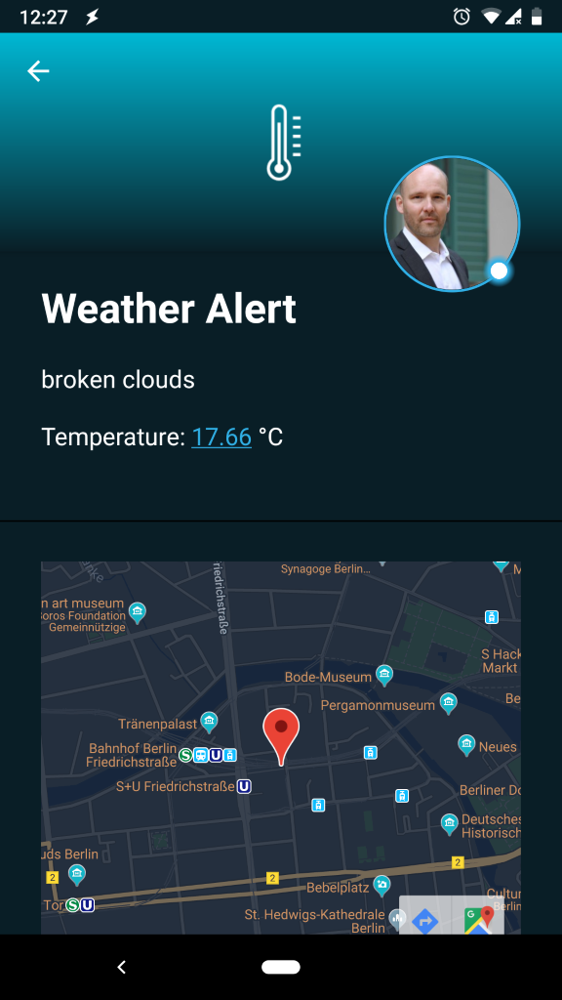
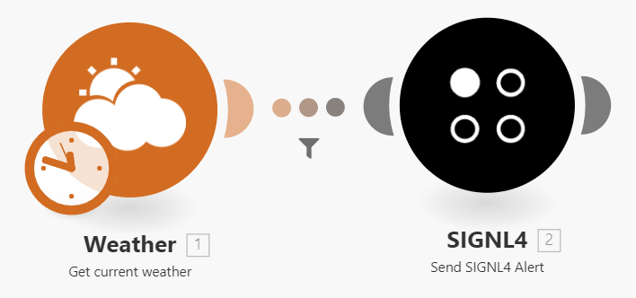
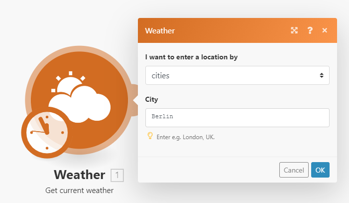
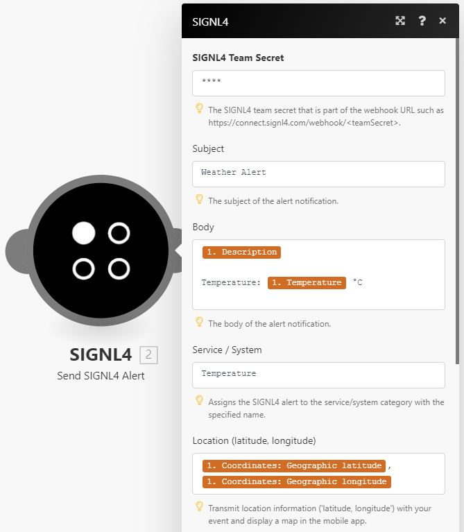
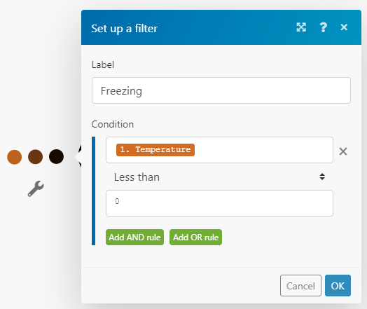

# Integrating SIGNL4 with Integromat

Mobile alerting with tracking, duty planning and escalation for Integromat.

## Why SIGNL4

Integromat is an advanced online automation platform. It is capable of connecting your Web apps as well as transferring and transforming your data. Pairing Integromat with SIGNL4 can enhance and automate your daily tasks with an extension to your mobile team no matter where they are.

## How it Works

Sending alerts to your SIGNL4 team from within Integromat is straightforward. SIGNL4 is available as a standard module in Integromat and you can directly add it to any of your scenarios.

## Integration Capabilities

- Service engineers alerted via mobile push, text and voice
- Staff can acknowledge and take ownership for critical events that occur
- Alerts are escalated in case of no response
- Communicate within an alert to address a particular problem
- Alert on critical device states
- Two-way integration to interact or set the device state

## Scenarios

- Workflow automation
- DevOps
- IT operations
- Service Management
- IoT
- IT, Manufacturing, Utility, Oil and Gas, Agriculture, etc.

## How To Integrate

### Integrating SIGNL4 with Integromat

You can add the SIGNL4 module to any of your scenarios in order to send out reliable alert notifications to your team. In our example we use a super simple weather alert.

A typical example would be a snow or freezing alert. In this case we request the current weather information for a certain city every hour and if the temperature is below zero degrees centigrade or if it is snowing we trigger an alert in SIGNL4.

SIGNL4 is a mobile alert notification app for powerful alerting, alert management and mobile assignment of work items. Get the app at https://www.signl4.com.

### Prerequisites

A SIGNL4 (www.signl4.com) account

An account at Integromat (www.integromat.com)

#### Integration Steps

1. Create a new Scenario in Integromat

In Integromat create a new scenario. In our example we just need two modules, Weather and SIGNL4.

2. Add the Trigger

Our trigger is time based and we can just configure an interval of one hour here. As our initial action we add "Get current weather" from the Weather module.

3. Add the SIGNL4 Module

Now as our second module we add SIGNL4. From there you select the action "Send SIGNL4 Alert" and you fill in the appropriate values. The SIGNL4 Team Secret is the last part if your webhook URL: https://connect.signl4.com/webhook/<team-secret>.

You can add static text as well as dynamic content from your previous weather request, e.g. description, temperature or location data.

4. Add a Filter

You can use filters to send alert notifications only under certain conditions. In our case we only send the notification in case the temperature is below zero degrees centigrade.

5. Test it

That is it. Now you can save and activate your scenario. And you can test it.

Testing is very convenient. You can run your whole scenario (maybe adapt your filter for testing). Or, you can just run the SIGNL4 module. You should then receive an alert on your SIGNL4 app.

You can find a sample script in GitHub:
https://github.com/signl4/signl4-integration-integromat
